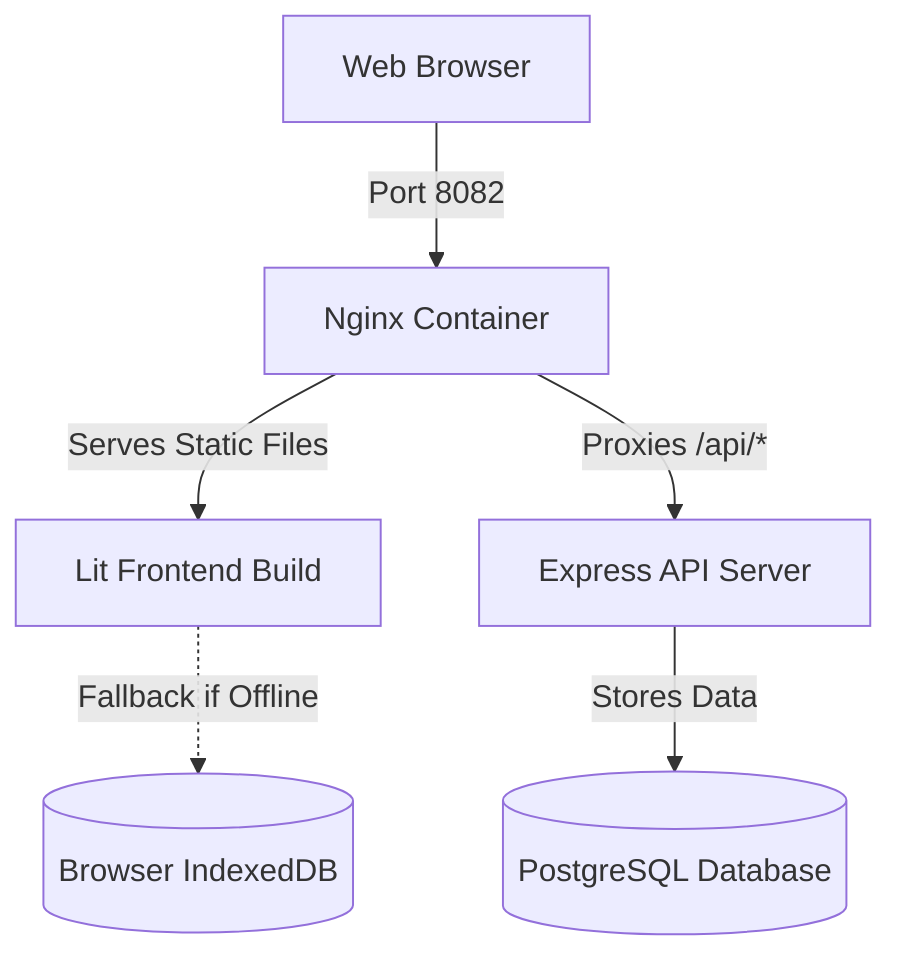

# JS News Hub - Dockerized Release Reader

This project is a dockerized single-page application built with **Lit 3**, **TypeScript**, and **Vite** that reads and aggregates news and release notes from GitHub repositories. It integrates with a **Node.js Express backend** and a persistent **PostgreSQL database** to store news sources, user settings (including GitHub tokens), and saved/cached articles.

---

## Architecture Overview

The application features a resilient, hybrid storage model:
1. **Primary Database (PostgreSQL)** is the central repository for sources, saved articles, settings, and cached news feeds.
2. **Offline Fallback (IndexedDB)**. The frontend queries the Express APIs first. If the backend is unreachable (e.g. server offline or network issues), the app falls back to the client-side IndexedDB database. Any changes are automatically cached locally so that the application remains fully functional offline.
3. **Gateway (Nginx)** serves the compiled static frontend files and proxies API requests starting with `/api/` directly to the Express backend container, preventing CORS issues.



---

## Getting Started (Docker Compose)

The easiest way to run the entire stack is using Docker Compose:

### 1. Prerequisites
Ensure you have Docker and Docker Compose installed:
- [Docker Engine](https://docs.docker.com/engine/install/)
- [Docker Compose](https://docs.docker.com/compose/install/)

### 2. Launch the Application
Run the following command in the project root directory:
```bash
docker compose up --build
```

This command will:
- Spin up a PostgreSQL 16 container.
- Build the Node.js backend container, wait for the Postgres database to initialize, create the database schema, and seed default sources.
- Build the frontend static asset production bundle and serve it via Nginx.

Once started, the application is available at:
- **Frontend App**: [http://localhost:8082](http://localhost:8082)
- **Backend API**: [http://localhost:3000](http://localhost:3000)

### 3. Tear Down
To stop and remove all containers, networks, and resources created by the stack:
```bash
docker compose down
```
If you also want to delete the persistent PostgreSQL volume to reset the database:
```bash
docker compose down -v
```

---

## Local Development (Without Docker)

You can also run the components locally for rapid development:

### 1. Run the Backend
Ensure you have a PostgreSQL instance running locally, then:
```bash
cd backend
npm install
# Set connection variables in .env or run with defaults:
# Default assumes host=localhost, port=5432, user=postgres, password=postgres, database=news_sources
npm run dev
```

### 2. Run the Frontend
In a separate terminal, run the Vite development server:
```bash
npm install
npm run dev
```
By default, the frontend dev server runs on [http://localhost:5173](http://localhost:5173) and expects the API server to be running on [http://localhost:3000](http://localhost:3000).

---

## Database Schema Details

The PostgreSQL tables are automatically defined on startup in the Express server:
- **`sources`**: tracks GitHub repositories to aggregate releases from (e.g. Node.js, React, Lit).
- **`saved_articles`**: stores articles bookmarked by the user.
- **`cache`**: stores transient fetched news payloads to reduce GitHub API rate-limit usage.
- **`settings`**: manages user options, including the `github_token`.
